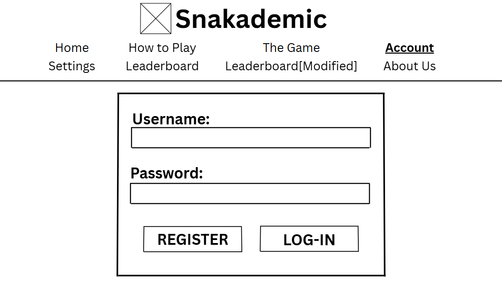
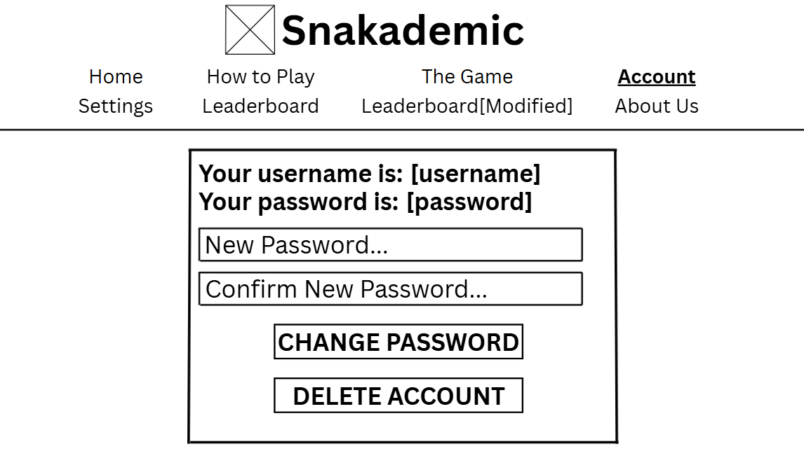
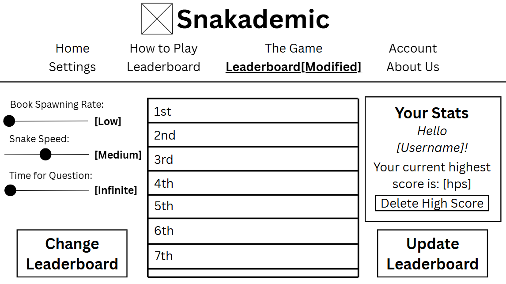
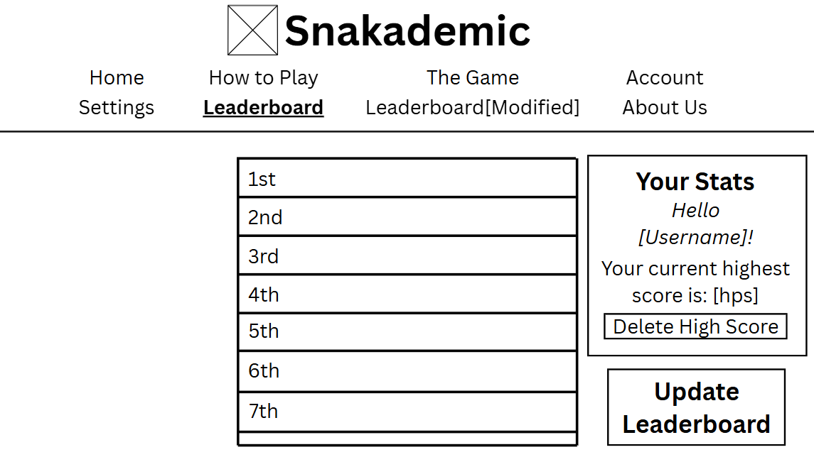
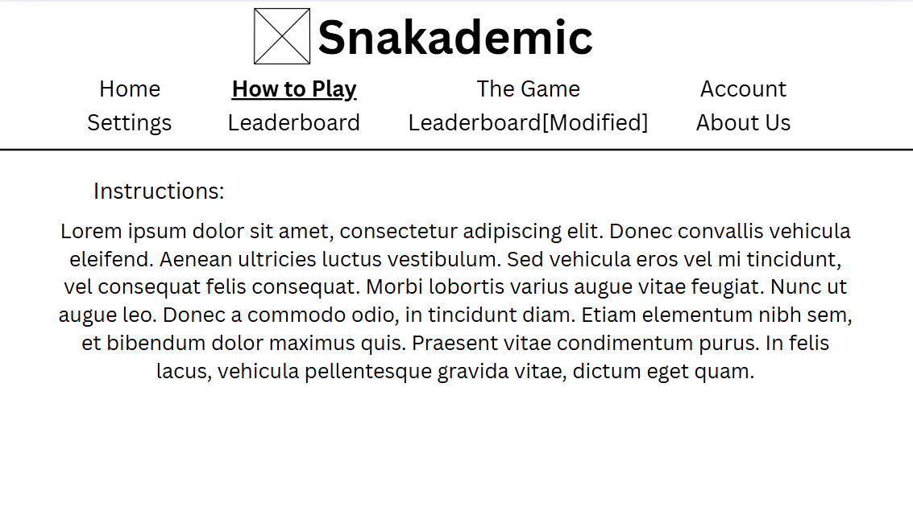
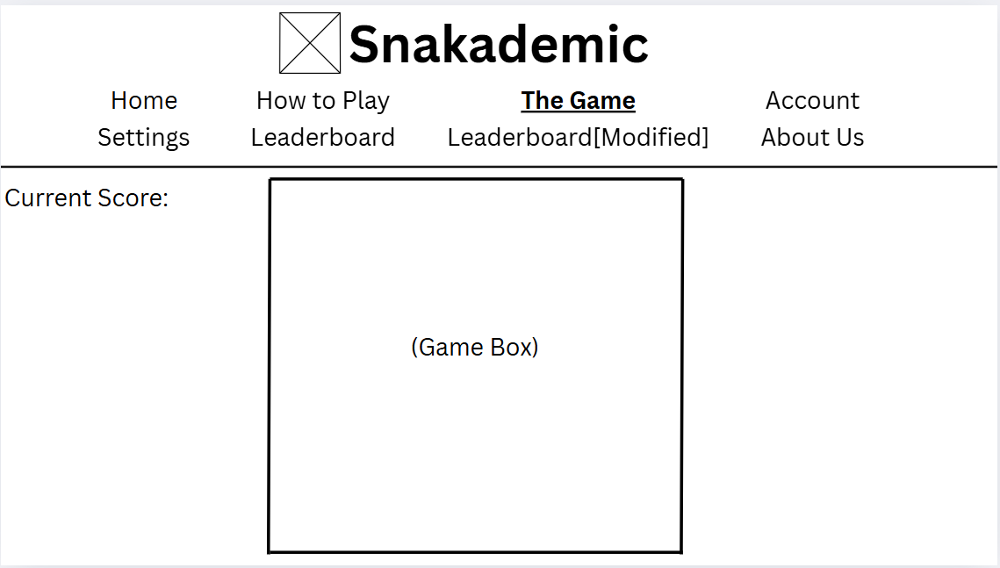
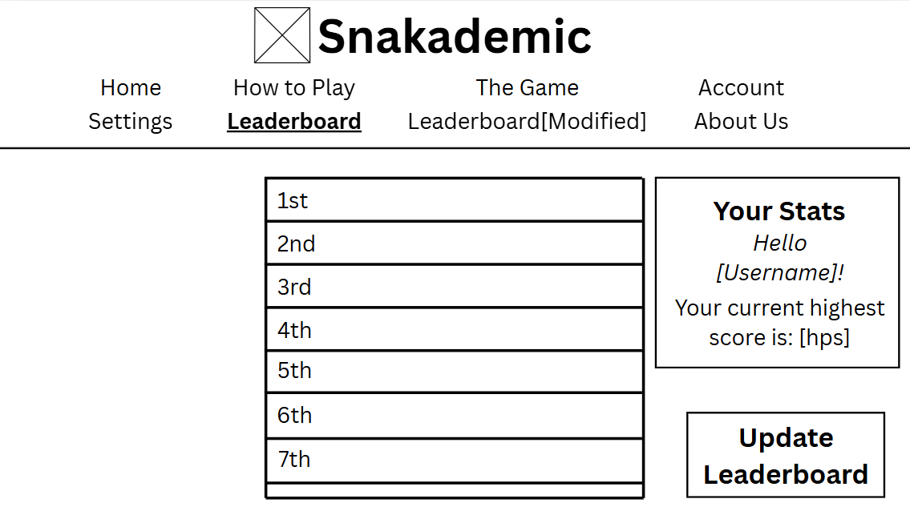
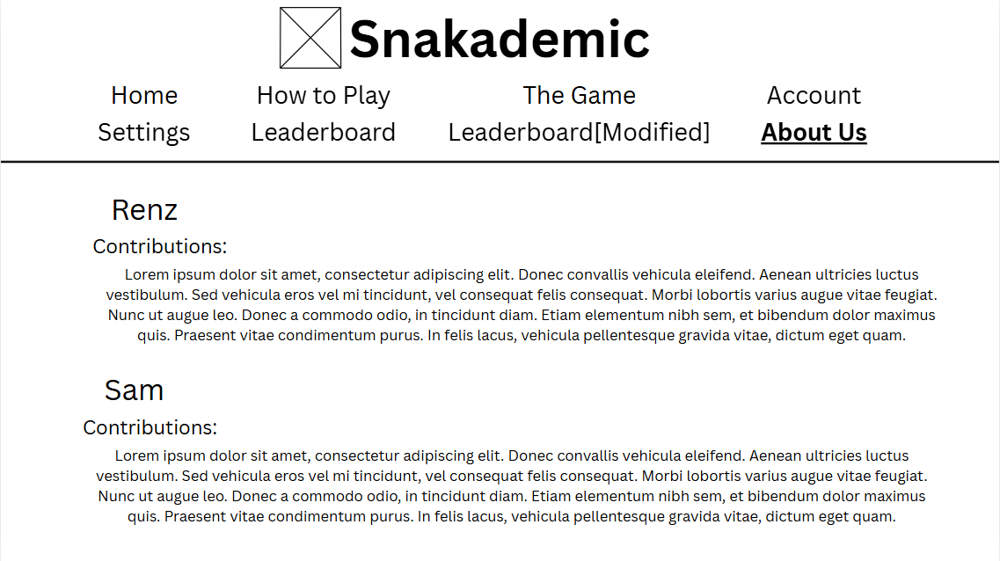
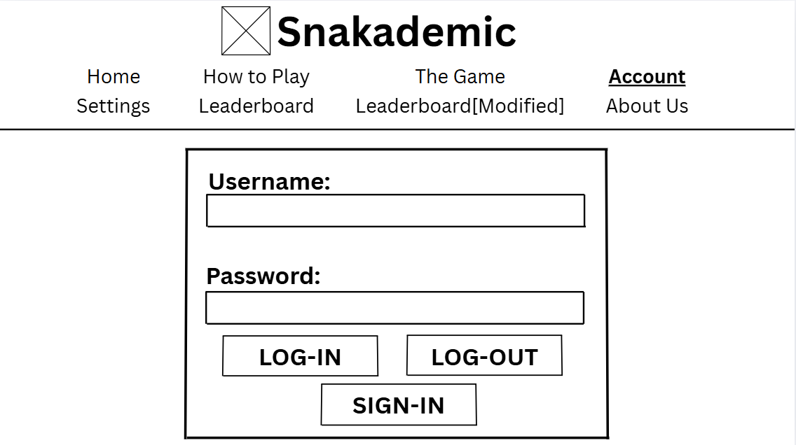
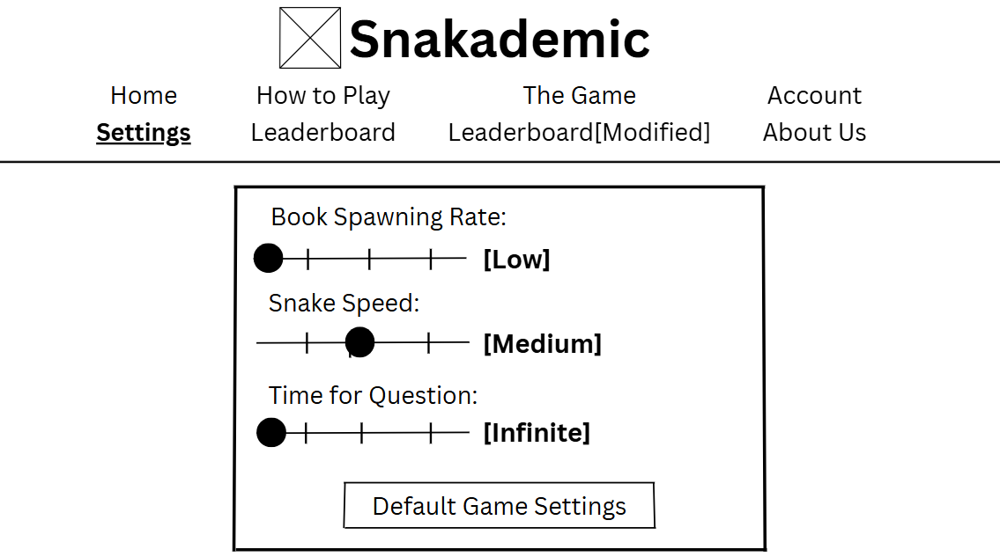

# Website Title: Snakademic

## Second title: “ Feed your mind, one book at a time”

## Logo:

### FINAL MODIFICATION PROPOSAL

When a user logs in or creates an account data such as the game settings they last had and highest score are saved in that account. The data is then used either to change the game according to the settings or show the highest score for that mode in the leaderboards. A new addition as part of the update plan are the decisions to delete the account or the high score of that account, as well as the ability to change the password of the account.

The Account page utilizes Conditional Rendering which shows a different layout and page when logged in or logged out.

When logged out the page shows two textboxes on account name and password respectively. This page gives the user the decision to either create an account or log in to an existing account. When the user is logged in or just created an account when the page is refreshed these text and layout will not appear.

When a user is logged in to an account or just logged in then refreshed the account page will instead show what a layout of this image. In this version, the user has the ability to change the password of the account or delete the account. When the user clicks the delete account button an alert will pop up warning the user if they actually wanted to delete the account and that the decision is permanent and irreversable.

The leaderboard pages both the default and modified have a new button that allows the user to delete their highscore however an alert will pop up and warn the user that the decision is permanent and cannot be reversed.

Leaderboard Modified page with the delete button below the user stats

Default Leaderboard witht the delete button below the user stats

Extra Changes
1. The color and layout of the website will be improved to be more consistent.
5. Adding a design to the snake and color to the grid, to make the game more visually appealing.

#### Website Description: Snakademic is an education web game inspired by the classic snake game. Instead of eating apples, the snake collects books that represent knowledge. Each book collected adds to your learning score. The game aims to make learning fun and interactive while improving focus and reflexes.
  
#### Javascript Description: Javascript will be used heavily in the webpage that the user will play in. The user will first input a name, before starting the game. Once they click start, the popup will disappear and a 3 second timer is shown with the map fully displayed until the game starts. Javascript will primarily be used for making the game work.

### Outline of the website:
1. Home - introduces what the game is about.
2. How to Play - Provides a guide on how to play the game
3. The Game - The page where the game is played.
4. Leaderboard - Shows the scores of the top 20 players. Updates every time it is refreshed.
5. About Us - Provides tasks and roles of the creators for the making of the website.

## Wireframes:

### Home Page (Top part)

### How To Play Page

### The Game Page

### Leaderboard Page

### About Us Page

### Project Proposal Update Plan

1. The updated "Snakademic" website will use HTML forms to give users control over the mechanics of the game. By doing this, we allow users to customize the game mechanics and rules, instead of a default game that they will repeatedly play. We are implementing a configuration that appears on two different webpages, the settings page and modified leaderboard page. This form uses range sliders for thre specific game variables, Book Spawning Rate, Snake Speed, and Time for Question. The Book Spawning Rate controls how often food appears, the Snake Speed controls how fast the snake moves, the Time for Question controls the countdown timer for answering academic questions.

2. Since the user needs these settings to remain active while they navigate between pages, we will use LocalStorage. When the user adjusts the sliders on the settings page and clicks "Default Game Settings", the specific values (Low, Medium, Infinite) are saved to the user's browser. When the user logs in, their username is also saved to LocalStorage so that the website remembers who they are.

3. The wireframe demonstrate how this saved data is used in the Settings page and Leaderboard[Modified] page. The settings page acts as the control center. The form here is used to input and save the selected difficulty levels. For example, if a student wants a faster paced game, they ccan set the Snake Speed to high and save it. The Leaderboard[Modified], on the otherhand, uses the saved data to personalize the view. For example, the Personal Stats box retrieves the saved username to display a personalized greeting alongside their personal high score in the account. Another example is for filtering results of the leaderboard, the sliders appear here again, but for a different purpose. Instead of setting the game rules, they act as filters. By adjusting the Snake Speed slider and clicking Change Leaderboard, the user can tell the list to only display the scores from other players who played that specific combination of game rules and mechanics with that specific difficulty. This ensures the ranking is fair.

4. 
### Sign-in Page

### Game Settings

### Leaderboard[Modified]

