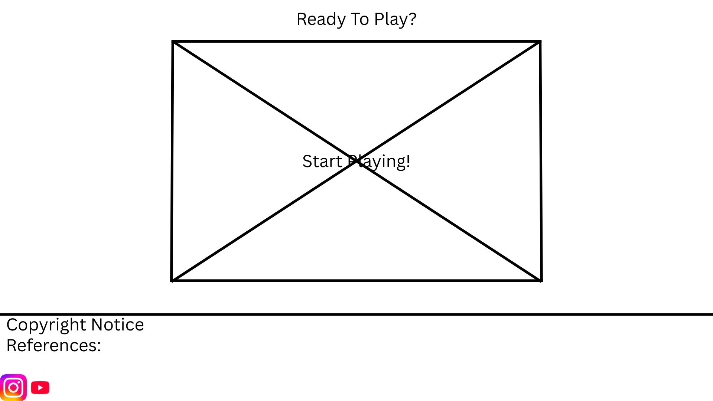

# Website Title: Snakademic

## Second title: “ Feed your mind, one book at a time”

## Logo:

#### Website Description: Snakademic is an education web game inspired by the classic snake game. Instead of eating apples, the snake collects books that represent knowledge. Each book collected adds to your learning score. The game aims to make learning fun and interactive while improving focus and reflexes.
  
#### Javascript Description: Javascript will be used heavily in the webpage that the user will play in. The user will first input a name, before starting the game. Once they click start, the popup will disappear and a 3 second timer is shown with the map fully displayed until the game starts. Javascript will primarily be used for making the game work.

### Outline of the website:
1. Home - introduces what the game is about.
2. How to Play - Provides a guide on how to play the game
3. The Game - The page where the game is played.
4. Leaderboard - Shows the scores of the top 20 players. Updates every time it is refreshed.
5. About Us - Provides info and reason for making of the creators of the website.

## Wireframes:

### Home Page (Top part)

### Home Page (Bottom part)

### How To Play Page

### The Game Page

### Game Settings

### Leaderboard Page

### About Us Page

### Project Proposal Update Plan

1. The updated "Snakademic" website will use HTML forms to give users control over the mechanics of the game. By doing this, we allow users to customize the game mechanics and rules, instead of a default game that they will repeatedly play. We are implementing a configuration that appears on two different webpages, the settings page and modified leaderboard page. This form uses range sliders for thre specific game variables, Book Spawning Rate, Snake Speed, and Time for Question. The Book Spawning Rate controls how often food appears, the Snake Speed controls how fast the snake moves, the Time for Question controls the countdown timer for answering academic questions.

2. Since the user needs these settings to remain active while they navigate between pages, we will use LocalStorage. When the user adjusts the sliders on the settings page and clicks "Default Game Settings", the specific values (Low, Medium, Infinite) are saved to the user's browser. When the user logs in, their username is also saved to LocalStorage so that the website remembers who they are.

3. The wireframe demonstrate how this saved data is used in the Settings page and Leaderboard[Modified] page. The settings page acts as the control center. The form here is used to input and save the selected difficulty levels. For example, if a student wants a faster paced game, they ccan set the Snake Speed to high and save it. The Leaderboard[Modified], on the otherhand, uses the saved data to personalize the view. For example, the Personal Stats box retrieves the saved username to display a personalized gretting alongside their personal high score in the account. Another example is for filtering results of the leaderboard, the sliders appear here again, but for a different purpose. Instead of setting the game rules, they act as filters. By adjusting the Snake Speed slider and clicking Change Leaderboard, the user can tell the list to only display the scores from other players who played that specific combination of game rules and mechanics with that specific difficulty. This ensures the ranking is fair.

4.