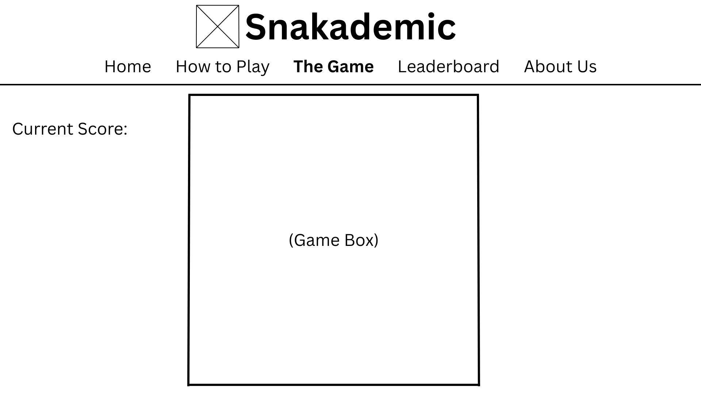

# Website Title: Snakademic

## Second title: “ Feed your mind, one book at a time”

## Logo:

#### Website Description: Snakademic is an education web game inspired by the classic snake game. Instead of eating apples, the snake collects books that represent knowledge. Each book collected adds to your learning score. The game aims to make learning fun and interactive while improving focus and reflexes.
  
#### Javascript Description: Javascript will be used heavily in the webpage that the user will play in. The user will first input a name, before starting the game. Once they click start, the popup will disappear and a 3 second timer is shown with the map fully displayed until the game starts. Javascript will primarily be used for making the game work.

### Outline of the website:
1. Home - introduces what the game is about.
2. How to Play - Provides a guide on how to play the game
3. The Game - The page where the game is played.
4. Leaderboard - Shows the scores of the top 20 players. Updates every time it is refreshed.
5. About Us - Provides info and reason for making of the creators of the website.

## Wireframes:

### Home Page (Top part)

### Home Page (Bottom part)

### How To Play Page

### The Game Page

### Leaderboard Page

### About Us Page
